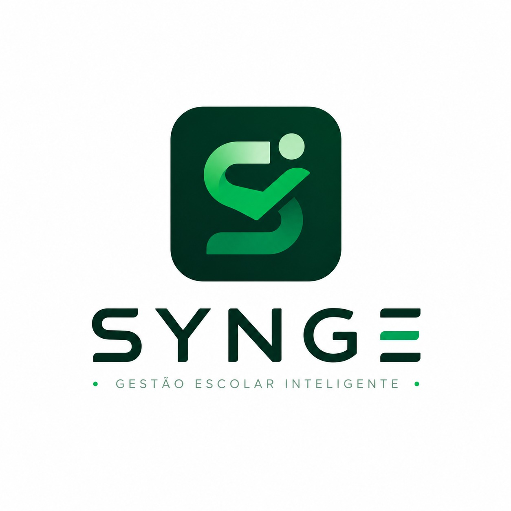

# SYNGE — Plataforma Inteligente de Gestão Escolar (Multi-Tenant)

  

## 📌 Apresentação do Projeto
O **SYNGE** é uma plataforma robusta e unificada de gestão escolar voltada para instituições de ensino básico (do Ensino Infantil ao Médio). Desenvolvido sob a arquitetura *Multi-Tenant*, o sistema isola de forma estrita e segura os dados de múltiplas escolas clientes utilizando uma única infraestrutura de software e banco de dados. 

A plataforma automatiza processos críticos divididos em 3 pilares principais: **Acadêmico** (diário de classe, chamada online e motor flexível de notas), **Administrativo** (controle de anos letivos, matrículas e repositório de documentos) e **Financeiro** (faturamento automatizado, regras de descontos familiares e controle ativo de inadimplência).

---**## 📺 Vídeo de Demonstração e Explicação
Clique na imagem abaixo para assistir ao vídeo explicativo detalhando o funcionamento da plataforma, a arquitetura técnica e os critérios de avaliação atendidos:

  

> 💡 *Nota: Caso o link acima não funcione, você também pode acessar o vídeo diretamente através do [Link Direto no YouTube](https://www.youtube.com/watch?v=imHUMOG4QYQ).*

## 🎓 Informações Acadêmicas
* **Disciplina:** Arquitetura e Projeto de Software (APS) — Período 2026.1
* **Professor Orientador:** Dr. Rodrigo Rebouças
* **Desenvolvedoras (Equipe):**
    * **Sthefanny Lara** (Responsável principal por Front-end & Design System)
    * **Mirela Ronze** (Responsável principal por Back-end & Infraestrutura)

---

## 🛠️ Stack Tecnológica & Engenharia

### Front-end
* **Linguagem & Estrutura:** HTML5 Semântico e CSS3 modularizado.
* **Design System:** Variáveis globais `:root` (arquivo `style.css`) aplicando estritamente a paleta de identidade visual institucional (Tons de Verde: `#004B1C`, `#0DB04B`, `#E5F5E5`).
* **Comportamento:** JavaScript Vanilla (Client-side) para validações estritas de formulários (como validação matemática de dígito verificador de CPF) e manipulação dinâmica de cookies para preferências de Tema Claro/Escuro.

### Back-end & Infraestrutura
* **Linguagem & Framework:** **Java** integrado ao ecossistema leve e de alta performance **Javalin**.
* **Banco de Dados:** **PostgreSQL** com isolamento lógico baseado no atributo chave `tenant_id` injetado em nível de repositório.
* **Ambiente de Desenvolvimento:** Conteneirização completa via **Docker** e **Docker Compose** para isolamento do banco de dados e padronização do ambiente local.

### Padrões de Projeto (Design Patterns Aplicados)
* **Strategy Pattern:** Encapsulamento dos algoritmos de fechamento acadêmico, permitindo alternar dinamicamente entre *Média Simples* e *Média Ponderada* sem acoplamento no código principal.
* **BaseDAO<T>:** Abstração genérica de persistência de dados para reuso de código SQL e blindagem contra SQL Injection.
* **Stateless JWT Middleware:** Interceptação automatizada de requisições restritas através de validação de tokens JWT armazenados em Cookies HttpOnly.

---

## 📅 Cronograma Mestre de Entregas (16/Junho a 06/Julho de 2026)

O desenvolvimento foi distribuído de maneira incremental e monitorado estritamente por meio de branches dedicadas no repositório:

* **FASE 1 (16 a 19 de Junho) — Fundação Visual e Site Institucional:** Criação do Style Guide global, páginas públicas (`home.html`, `recursos.html`, `sobre.html`) e inicialização do Javalin integrado ao banco PostgreSQL via Docker.
* **FASE 2 (20 a 22 de Junho) — Portal de Acesso e Segurança:** Criação da interface de login, criptografia de senhas com **BCrypt**, implementação do `AuthMiddleware` JWT e **Deploy inicial em produção**.
* **FASE 3 (23 a 26 de Junho) — Painel de Controle e Abstração:** Construção do layout master com sidebar administrativa e entrega do repositório genérico `BaseDAO` com proteção Multi-Tenant estável.
* **FASE 4 (27 a 30 de Junho) — Coração da Gestão Escolar:** Telas completas de controle de alunos, tratamento de máscaras de entrada no formulário de matrícula por ano letivo e tratamento robusto de exceções/logs em nível DEBUG.
* **FASE 5 (01 a 03 de Julho) — Engenharia Avançada:** Implementação do motor de cálculo de médias usando o padrão Strategy e criação de testes de cobertura automatizados.
* **FASE 6 (04 a 06 de Julho) — Homologação e Entrega Final:** Escrita do documento `COMPONENTS.md` para auditoria de reuso de componentes pelo professor, varredura de logs do sistema e Deploy final na nuvem para avaliação da banca.

